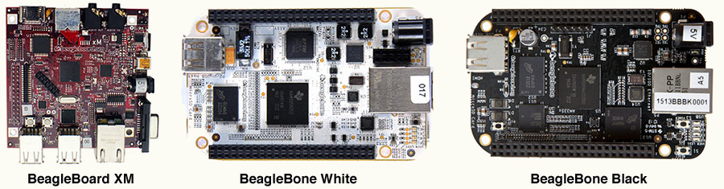

:kr: 미닉스 3을 알아보자

출처: http://www.minix3.org

미닉스(MINIX) 3은 무엇인가?

> 미닉스 3은 높은 신뢰성, 유연하고, 안전하게 설계된 자유로운, 공개된원본, 운영체제이다. 이것은 커널모드에서 실행되는 꼬맹이 마이크로커널을 기반으로 나머지 운영체제가 실행된다 사용자모드에서 격리되고, 보호된 여러 프로세스로. 이것은 x86 및 ARM CPU에서 실행되며, NetBSD와 호환되고, 수많은 NetBSD 패키지를 실행한다. 지금즉시 미닉스 3을 마련하고 (우리의 커뮤니티에 가입)[http://wiki.minix3.org/doku.php?id=www:community:]하라!

목록
1. 미닉스(MINIX) 3은 무엇인가?
2. 원본코드 및 권한
3. 미닉스(MINIX) 3의 역사
4. 컴퓨터에 미닉스 3 설치하기
5. ARM에서의 미닉스 3
6. 현재상태
7. 미닉스 3 문서
8. 미닉스 3 동영상
9. 웹에서 미닉스 3

# 1. 미닉스(MINIX) 3은 무엇인가?

 미닉스 3은 운영체제 공부를 위해 사용할 수 있고, 연구과제의 기반, 또는 마이크로커널 시스템 시장을 장악하고 있는 상업용(소박이) 시스템을 위해 적합한 자유로운 공개원본 운영체제이다. 이 과제에 중점을 둔 부분은 내결함성과 자가치유 기술을 통해 높은 신뢰성을 달성하는데 있다.

 미닉스는 커널모드에서 실행되는 작은(약 12,000줄의 코드) 마이크로커널을 기반으로 한다. 운영체제의 나머지는 서버 프로세스들의 모음으로 실행된다, 각각은 하나의 하드웨어 MMU로 보호된다. 이러한 프로세스는 가상파일 시스템, 하나 이상의 실제파일 시스템, 메모리 관리자, 프로세스 관리자, 환생 서버, 그리고 장치 운전기를, 포함하여 별도의 사용자모드 프로세스로 분리되어 각각 실행된다.

 이 설계의 하나의 중요한 결과는 버그 또는 공격으로 인한 시스템의 오류가 격리된다는 것이다. 예를 들어, 버그 또는 악용으로 오디오 운전기가 고장 또는 탈취되면 이상한 소리가 날수 있다 하지만 운영체제의 완전한 탈취는 할 수 없다. 마찬가지로, 시스템 구성요소 고장 대부분의 경우 사랑의 개입없이 자동적으로 그리고 확실하게 복구될 수 있다. 다른 운영체제가 미닉스 3 처럼 자가치유 기능을 가진 경우는 거의 없다.

# 2. 원본코드 및 권한

 많은 기업과 개인의 두가지 핵심 질문은 원본코드와 권한에 관한 소프트웨어의 모든것을 이용할 수 있는가 이다. 미닉스 3은 공개된원본이다. [원본코드](http://wiki.minix3.org/doku.php?id=www:documentation:source) 전체는 학문적 개인적, 또는 상업적 목적을 위해 누구나 사용하고, 적합하다고 생각되는 대로 수정할 수 있다. 특히, 회사는 미닉스 3의 전체 또는 일부를 제품에 사용할 수 있다. 또한, 그것은 완전히 무료이다. 지원과 조언은 유료로 가능하다. 기업은 가격 책정을 위해 :envelope:info@minix3.org로 우리에게 연락해라.

 미닉스 3은 [BSD 유형 권한](http://wiki.minix3.org/doku.php?id=www:documentation:license)으로 사용 가능하다, 이는 GPL처럼 시스템 변경사항을 게시할 필요가 없으므로 기업에 매력적일 수 있다(예, 리눅스용).

# 3. 미닉스(MINIX) 3의 역사

 미닉스는 오랜 역사를 가지고 있다. 그것은 "운영체제: 설계와 구현(Operating Systems: Design and Implementation)"이라는 책이 Andrew S. Tanenbaum에 의해 첫번째 개정이 출판된 1987년으로 거슬러 올라간다. 미닉스릐 첫번째 판은 교육목적 이었다 그리고 아주 빠르게 아주 인기를 끌었다. 조기(早期) 사용자중 한명은 필란드 학생인, 리누스 토발즈(Linus Torvalds)다, 그는 책을 읽고 운영체제애 관한 모든것을 배웠다 그리고 시스템을 수정하였다. 결국 그는 자신의 운영체제를 작성했다, 리눅스(Linux)를. 2004년에, 켄 브라운(Ken Brown) 이라는 남자가 미닉스를 그대로 베낀 토발즈(Torvalds) 라고 비난했다, 그러나 앤드류 타넨바움(Andrew Tanenbaum)에 의해 2004년 5월 20일 발표된 성명으로 신속하게 반박했다.

 미닉스의 두번째 개정(그리고 책의 두번째 개정, Albert S. Woodhull과 공동저술한)은 1997년에 발표되었다. 이 판은 첫번째 판에서 크게 개선되었다. 그러나 여전히 운영체제를 광범위하게 가르치는 것을 목적으로 삼았다.

 이것은 오로지 세번째 판이다, 미닉스 3, 그리고 책의 세번째 개정은, 2006년에 출판되었다, 그 중점 변경은 교육에서 진지한 연구와 생산 시스템이다, 특히 소박이 시스템에 관한 것이다. 미닉스 2와 미닉스 3의 많은 차이중 일부는 [여기](http://wiki.minix3.org/doku.php?id=www:documentation:improvements)에 있다.

 이 과제는 2008년에 앤드류 타넨바움(Andrew Tanenbaum)이 유럽연구협의회(European Research Council) 상급보조금(Advanced Grant)을 수상 했을 때 큰 자극을 받았다. 이로 인해 연구와 제품개발은 5년간 가속화 되었다. 유럽연구협의회(ERC) 보조금 기간이 끝날 무렵, 그는 유럽연구협의회(ERC) 개념증명(Proof of Concept) 보조금을 받고, 미닉스 3을 ARM으로 포팅할 수 있었다 그리고 또한 2012년과 2013년에 뉘른베르크(Nuremberg)에서 열리는 소박이세계(Embedded World) 무역전시회에서 두차례 전시할 수 있었다.

# 4. 컴퓨터에 미닉스 3 설치하기

 설치가 간단하다. 먼저 CD-ROM 이미지를 내려받는다, `.iso` 파일인, 첫장에서 "지금받기" 단추를 클릭하여. 파일을 저장한다. 그런다음 PC에 설치하려는 경우, 먼저 CD-ROM에 `.iso` 파일을 넣는다 그리고 이것으로 컴퓨터를 부팅한다. 가상기계에 설치하려는 경우(예, VMware 에), `.iso` 파일을 CD-ROM으로 사용하도록 가상기계를 구성한다 그리고 그 가상기계를 부팅을 한다. 어느 쪽이든, 몇 초 안에 부팅된다. `root`(암호 없음)로 로그인 한다 그리고 `setup`을 입력한다. 이것은 한번에 한 단계씩 설치가 완료되도록 유도한다. 몇 분 밖에 걸리지 않는다. 완료되면, `reboot`를 입력한다. 재부팅 후, `root`로 다시 로그인 한다 그리고 실행한다. 더 자세한 지침은 첫장의 "[시작하기(GETTING STARTED)](http://wiki.minix3.org/doku.php?id=www:getting-started:start)" 탭에서 찾을 수 있다.

 미닉스 3 사용자영역은 :earth_asia:NetBSD와 크게(하지만 완전하지 않다) 호환된다, 이는 수많은 NetBSD 패키지를 미닉스 3에 설치되고 실행될 수 있음을 의미한다. 처음 시스템 설치가 끝난 후에, 당신은 아마도 수많은 패키지중 일부를 설치하려 할 것이다. 설치 방법은 `wiki` 탭에서 [사용자안내(UseGuide)](http://wiki.minix3.org/doku.php?id=usersguide:start) => [바이너리패키지 설치(Installing Binary Packages)](http://wiki.minix3.org/doku.php?id=usersguide:installingbinarypackages) 페이지를 봐라. 이것은 비글의 모습이다.

# 5. ARM에서의 미닉스 3

 소박이 시스템에 관심이 있다면, 지원되는 :earth_asia:비글중 하나를 원할 수 있다. 3개의 보드가 지원된다: 비글보드 XM(BeagleBoard XM), 비글본 하양(BeagleBone White), 그리고 비글본 검정(BeagleBone Black). 최고급라인 비글본 검정(BeagleBone Black)은 55달러다. 다른 것들은 조금 싸다. 당신의 관심이 여기에 있다면 당신은 개발자일 가능성 가장 높다. 그러므로 당신은 반드시 (미닉스 3 ARM 개발자 안내[MINIX 3 ARM developers guide)](http://wiki.minix3.org/doku.php?id=developersguide:minixonarm)를 읽어야 한다.

 

 이러한 보드는 ARM CPU를 사용하는 개발시스템이다. 비글본 검정(BeagleBone Black)을, 예로 들면, 1-GHz ARM Cortex A8, 512MB RAM, 4GB flsh SSD 탑재, 그리고 micro-SD를 위한 코넥터, micro-HDMI, USB, 그리고 이더넷을 가진다.

# 6. 현재상태

 미닉스 3은, 모든 소프트웨어와 마찬가지로, 아직 개발중이다, 하지만 현재 공개된, 3.3.0은, x86 과 ARM 작업대에 대하여 신뢰성, 안정성, 자가치유할 수있는 판이다. 개발은 진행중이다 그리고 우리는 당신이 커뮤니티에 가입하고 도와주기를 바란다.

# 7. 미닉스 3 문서

 거의 모든 문서는 [미닉스 3 위키(MINIX 3 wiki)](http://wiki.minix3.org/doku.php?id=start)에 있다. 이것은 미닉스 3과 관련된 많은 주제에 대한 정보가 딤긴 페이지 모음이다. 막 시작했을 때, 당신은 자주 상담해야 한다. 일단 아주많은 경험을 하게되면, 당신은 이것을 수정할 수 있다, 페이지 갱신 또는 새로운것 추가, 위키피디아 처럼.

# 8. 미닉스 3 동영상

 앤드류 타넨바움은 미닉스 3에 대한 몇개의 비디오를 제작했다. 다음같이 유튜브에서 볼 수 있다.

- :earth_asia:[앤드류 타넨바움의 뉘른베르크 소박이 세계전시회에서 미닉스 3 시연](https://www.youtube.com/watch?v=vlOsy0PZZyc&feature=youtu.be)
- :earth_asia:[앤드류 타넨바움과의 회견, IEEE //컴퓨터 //잡지](http://www.youtube.com/watch?v=86_BkFsb4eI)
- :earth_asia:[FOSDEM에서 앤드류 타넨바움의 미닉스 3에 관한 이야기](http://www.youtube.com/watch?v=bx3KuE7UjGA)

# 9. 웹에서 미닉스 3

 미닉스 3은 웹의 여러 곳에서 출현했다. 여기에 몇개의 참조가 있다.

- :earth_asia:[IEEE 컴퓨터 잡지](http://www.computer.org/csdl/mags/co/2014/07/mco2014070007.pdf)
- :earth_asia:[LOGIN](http://c59951.r51.cf2.rackcdn.com/5663-61781-tanenbaum.pdf)
- :earth_asia:[위키피디아에서 MINIX 3](http://en.wikipedia.org/wiki/MINIX_3)
- :earth_asia:[위키피디아에서 MINIX](http://en.wikipedia.org/wiki/MINIX)
- :earth_asia:[OS 소식](http://www.osnews.com/story/15960/Introduction-to-MINIX-3/)
- :earth_asia:[PC 리눅스 OS 잡지](http://pclosmag.com/html/Issues/201112/page15.html)
- :earth_asia:[DistroWatch](http://distrowatch.com/table.php?distribution=minix)
- :earth_asia:[리눅스 학술지](http://www.linuxjournal.com/article/10754)
- :earth_asia:[Slashdot](http://tech.slashdot.org/story/13/02/23/1946247/minix-321-released)
- :earth_asia:[LWN](http://lwn.net/Articles/485658/)
- :earth_asia:[리눅스 잡지](http://www.linux-magazine.com/Issues/2009/99/Minix-3)
- :earth_asia:[InfoQ](http://www.infoq.com/news/2009/05/MINIX)
- :earth_asia:[Encyclopine](http://encyclopine.org/en/MINIX_3)
- :earth_asia:[Phoronix](http://www.phoronix.com/scan.php?page=news_item&px=MTU5MzY)
